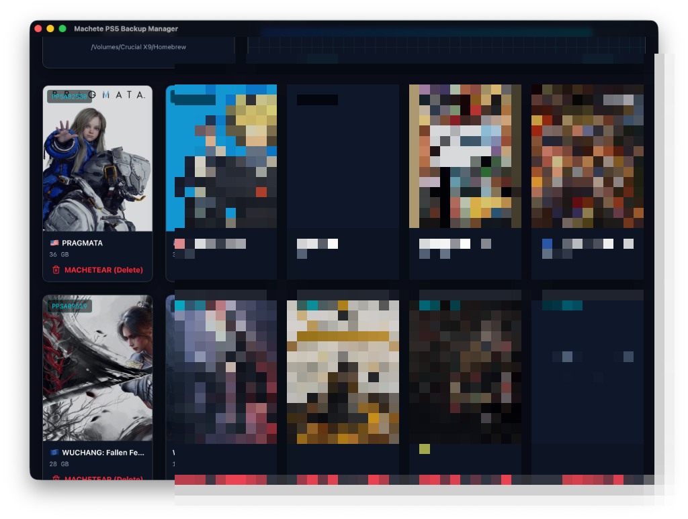

<div align="center">

# 🔪 Machete PS5 Backup Manager

**Deja de apostar con tus respaldos. Empieza a verlos.**

[](https://www.gnu.org/licenses/gpl-3.0)
[]()
[]()

</div>

---

## El Problema

Tienes un disco externo de 2TB lleno de respaldos de PS5. Decenas de archivos `.exFAT`, `.ffpfsc` y carpetas — todos con nombres crípticos como `PPSA04264` o `PPSA29343.exfat`. ¿Cuál es el GTA V? ¿Cuál es el Ghost of Tsushima? No tienes ni idea. Y cuando necesitas liberar espacio, estás a un clic de borrar 96GB del juego equivocado. **Para siempre.**

Ese caos termina hoy.

## La Solución

**Machete** escanea tu directorio de respaldos, lee el PPSA ID de cada archivo y carpeta, y al instante obtiene el **nombre oficial del juego y la carátula en alta calidad** desde la base de datos de SerialStation. En segundos, tu desastre ilegible se convierte en una galería visual impresionante donde puedes identificar cada respaldo de un vistazo.

Sin más adivinanzas. Sin más accidentes. Sin más desastres.

<div align="center">



</div>

---

## ✨ Características

### 🔍 Reconocimiento Inteligente
Machete detecta automáticamente archivos `.exFAT`, `.ffpfsc` y carpetas que contienen respaldos de PS5. Extrae el Title ID (PPSA) y lo resuelve al nombre real del juego y su región — sin intervención manual.

### 🎨 Carátulas Instantáneas
Cada juego reconocido obtiene su arte de caja oficial directamente de SerialStation. Tu disco de respaldos pasa de ser un muro de texto a una biblioteca visual en segundos. El sistema de búsqueda cross-región garantiza la máxima cobertura.

### 🛡️ Cero Riesgo para tus Archivos
Machete **jamás** renombra, mueve ni modifica tus archivos originales. Todos los títulos personalizados y las carátulas custom se almacenan en una base de datos local en tu sistema. Tus respaldos se quedan exactamente como están.

### ✏️ Edición Manual
¿Un juego no fue reconocido? Sin problema. Pasa el mouse por encima de cualquier entrada para editar manualmente el título o asignar una carátula personalizada — todo almacenado localmente, todo reversible.

### 🗑️ Eliminación Segura
Cuando necesites liberar espacio, la función de eliminación de Machete muestra una advertencia clara y localizada antes de borrar permanentemente cualquier archivo o carpeta. Sin eliminaciones silenciosas, sin sorpresas.

### 🌍 11 Idiomas
Inglés, Español (Venezuela), Francés, Alemán, Italiano, Portugués (BR y PT), Ruso, Japonés, Chino, Coreano y Árabe. Cada etiqueta, cada advertencia, cada entrada del changelog — completamente traducido.

### 🕵️ Privacidad Ante Todo
Todas las solicitudes a la API están completamente anonimizadas. Sin headers de rastreo, sin user-agents identificables, sin cookies. Machete no deja rastro de tu actividad en ningún servidor externo.

### ⚡ Velocidad Brutal
Construido con **Tauri + Rust** en el backend y **React + TypeScript** en el frontend. Rendimiento nativo en cada plataforma, con una fracción del consumo de memoria de las alternativas basadas en Electron.

---

## 🚀 Instalación

### Descarga
Ve a la página de [Releases](https://github.com/VenezuelanBiggie24/Machete-PS5-Backup-Manager/releases) y descarga el instalador para tu plataforma:

| Plataforma | Formato |
|------------|---------|
| macOS | `.dmg` / `.app` |
| Windows | `.msi` / `.exe` |
| Linux | `.AppImage` / `.deb` |

### Compilar desde el Código Fuente
```bash
git clone https://github.com/VenezuelanBiggie24/Machete-PS5-Backup-Manager.git
cd Machete-PS5-Backup-Manager
npm install
npm run tauri build
```

**Requisitos:** Node.js 18+, Rust 1.70+

---

## 🛠️ Stack Tecnológico

| Capa | Tecnología |
|------|-----------|
| Backend | Rust (Tauri v2) |
| Frontend | React 18 + TypeScript |
| Estilos | Tailwind CSS |
| Animaciones | Framer Motion |
| API | SerialStation (anonimizada) |
| i18n | i18next (11 idiomas) |
| BD Local | Archivo JSON en AppData del sistema |

---

## 📜 Licencia

Este proyecto está licenciado bajo la **GNU General Public License v3.0** — consulta el archivo [LICENSE](LICENSE) para más detalles.

Eres libre de usar, modificar y redistribuir este software. Cualquier trabajo derivado también debe ser publicado bajo GPLv3. Este código permanecerá libre y de código abierto, para siempre.

---

## 👤 Autor

**VenezuelanBiggie24**

Un orgulloso desarrollador venezolano. Aunque las realidades del comunismo me obligaron a dejar mi hogar, esa adversidad se transformó en resiliencia, permitiéndome hoy escribir código y crear soluciones sin fronteras desde cualquier rincón del mundo.

---

<div align="center">

⭐ **Si Machete te salvó de un desastre con tus respaldos, considera dejar una estrella** ⭐

</div>
